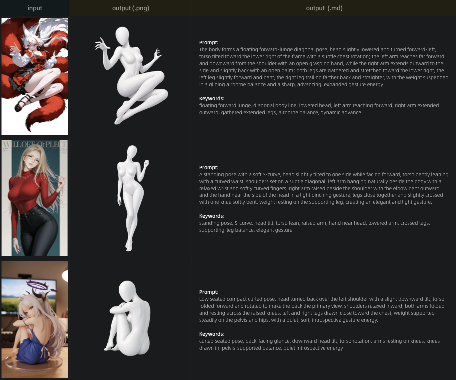

# Posture Extractor

[English](#posture-extractor) | [中文](#姿态提取器)

Posture Extractor is an agent skill for creating clean white-model pose references from an uploaded character or person image. It extracts only the subject's pose, applies it to a male or female white-model template, and outputs a validated transparent PNG plus bilingual Chinese-English AIGC-ready pose descriptions. The workflow generates the posed white model on a high-contrast solid-color background, locates the generated raster, removes the background, and validates the saved `1024x1024` `RGBA` PNG before delivery. Solid-background generations, uncut images, checkerboard previews, templates, and other intermediate images are not final outputs unless explicitly requested for diagnostics. Character-specific details such as clothing, hair, accessories, props, backgrounds, facial likeness, facial features, and expression details are removed; the final white-model head stays smooth and featureless, preserving only head direction and tilt.

## Templates

White-model templates are stored in:

```text
template/
├── female.png
└── male.png
```

`female.png` is used for female-presenting subjects, and `male.png` is used for male-presenting subjects.

## Usage

Provide an image directly, or pass an image path when invoking the skill. Codex uses `$posture-extractor`; Openclaw, Hermes Agent, and Claude Code use `/posture-extractor`.

```text
$posture-extractor path/to/image
/posture-extractor path/to/image
```

## Sample



## Installation

Send this to an agent that can install local skills:

```text
Install the skill from https://github.com/TengShao/posture-extractor and keep the installed skill name as posture-extractor.
```

---

# 姿态提取器

[English](#posture-extractor) | [中文](#姿态提取器)

姿态提取器是一个 agent skill，用于根据用户上传的人物或角色图片生成干净的白模姿态参考图。它只提取主体姿态，应用到男性或女性白模模板上，并输出通过校验的透明背景 PNG 和中英双语 AIGC 图片生成动作描述。工作流会先生成带高色差纯色背景的白模姿态图，再找到生成图落盘文件、后处理抠图，并在交付前校验保存后的 `1024x1024` `RGBA` PNG。纯色背景生成图、未抠图图片、棋盘格预览、模板图和其他中间图片都不是最终输出，除非用户明确要求用于诊断。它会去掉服饰、头发、饰品、道具、背景、面部相似性、五官和表情细节等角色造型和场景细节；最终白模头部保持光滑无五官，只保留头部朝向和倾斜。

## 模板

白模模板位于：

```text
template/
├── female.png
└── male.png
```

`female.png` 用于女性主体，`male.png` 用于男性主体。

## 使用方式

可以直接上传图片，也可以在唤醒 skill 时传入图片路径。Codex 使用 `$posture-extractor`；Openclaw、Hermes Agent、Claude Code 使用 `/posture-extractor`。

```text
$posture-extractor path/to/image
/posture-extractor path/to/image
```

## 示例


## 安装

把下面这段话发送给支持安装本地 skill 的 agent：

```text
请从 https://github.com/TengShao/posture-extractor 安装这个 skill，并保持安装后的 skill 名称为 posture-extractor。
```
